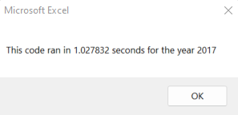
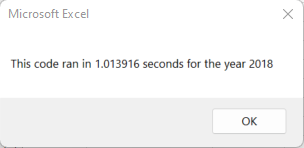
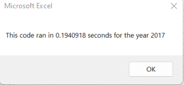
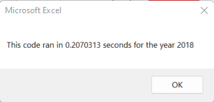
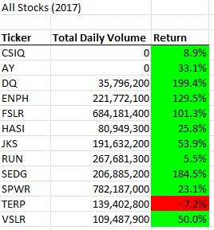

# stock-analysis

## Project Overview

    The goal of this project is to refactor a VBA macro. 
    The macro processes daily equity price and volume data for a number of equities.
    The refactoring is intended to ensure the macro can efficiently scale from processing a small number of stocks to a large number of stocks.

## Results

    Refactoring the macro improved average run time by a factor of 5.
    
    The original macro, on a core i5 laptop with 8 GB of RAM, took around 1.2 seconds to run, as shown in the following screen shots:
### Before Refactoring
|

    The refactored macro, on the same laptop, took roughly 0.2 seconds to run:
### After Refactoring
|

## Summary

### General Comments:
Refactoring is an important part of the coding process. It allows experience accrued from the running of the code to be applied back to the code itself. Refactoring maintains the external functionality of the code while enhancing/updating the internal structure. The process of refactoring can yield:
- better quality code
- improved runtime
- better readability (making future maintenance easier)
- Finally, per [quora](https://www.quora.com/What-are-the-pros-and-cons-of-refactoring), it decreases the number of WTF's per minute.

Challenges to refactoring include:
- difficulty reading/understanding code written by others
- time constraints
- the risk of unexpected outcomes in large/complex code bases

### Project Specific Comments:
The refactoring of this particular VBA code involved some trade offs:
- the original code looped through all cells for each ticker
    - that process allows for the array of tickers to be in a different order that the tickers on the data sheet
- the refactored code loops through all cells only once, and iterates through the ticker list with the ticker changes on the data sheet
 - if we change the order of tickers in the macro, we get inaccurate results. The following screen shot shows results for 2017 if we swap the tickers in position 0 and 1 in the ticker array (i.e switch positions of AY and CSIQ):

 

- An important improvement to the refactoring would be ensure the macro automatically sorts data by date and ticker prior to running the rest of the analysis, to ensure the internal logic in the macro is consistent with the actual data being processed.

